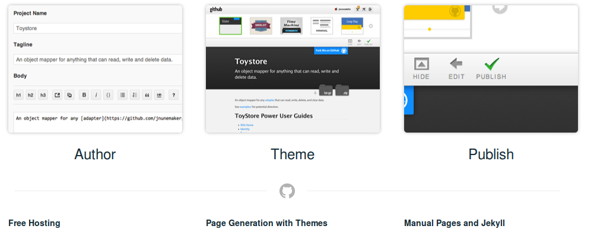
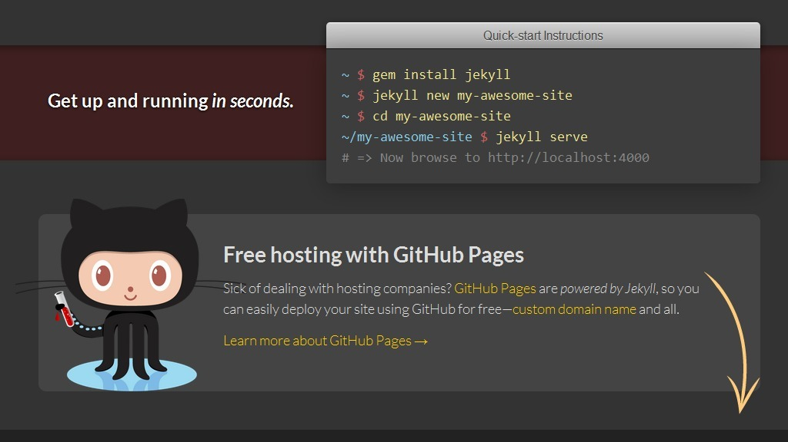

## Github Pages中级教程

[陈堰平](http://weibo.com/rucypchen) 

--- 

## 目录

- HTML/CSS 初步
- markdown介绍
- github的使用
- github pages网站的搭建

--- #config

## 幻灯片设置

Reveal.js的主题设置：

[Sky](?theme=sky#/config) - [Beige](?theme=beige#/config) - [Simple](?theme=simple#/config) - [Serif](?theme=serif#/config) - [Night](?theme=night#/config) - [Default](?theme=default#/config) - [Solarized](?theme=solarized#/config) - [Moon](?theme=moon#/config)

选择切换方式： 

[Cube](?transition=cube#/config) - [Page](?transition=page#/config) - [Concave](?transition=concave#/config) - [Zoom](?transition=zoom#/config) - [Linear](?transition=linear#/config) - [Fade](?transition=fade#/config) - [None](?transition=none#/config) - [Default](?transition=default#/config)

--- &vertical

## HTML/CSS 初步

***

## HTML 概述

-   HTML 指的是超文本标记语言 (Hyper Text Markup Language)
-   HTML 不是一种编程语言，而是一种标记语言 (markup language)
-   标记语言是一套标记标签 (markup tag)
-   HTML 使用标记标签来描述网页

***  

## CSS 概述

-    CSS 指层叠样式表 (Cascading Style Sheets)
-    样式定义如何显示 HTML 元素
-    样式通常存储在样式表中
-    把样式添加到 HTML 4.0 中，是为了解决内容与表现分离的问题
-    外部样式表可以极大提高工作效率
-    外部样式表通常存储在 CSS 文件中
-    多个样式定义可层叠为一

***

## 学习资源

- [w3school](http://www.w3school.com.cn/)   在线帮助
- [Codecademy](http://www.codecademy.com/) 在线交互式学习网站
- [Code School](http://www.codeschool.com/‎) 同上，一部分课程免费
- [百度文库视频教程](http://wenku.baidu.com/course/list/9)
- [自学it网](http://zixue.it) 

--- &vertical

## markdown介绍

***

## 语法介绍

- [英文教程](http://daringfireball.net/projects/markdown/syntax/)
- [中文教程](http://wowubuntu.com/markdown/)

***

## 几种解析markdown的工具

- R + markdown包
- RStudio
- sublime text2 + Markdown Preview插件
- pandoc

***

## 用markdown写slides的工具

- R + slidify包，参考文章[实现可重复的统计slides](http://xccds.github.io/2013/04/slides.html)，[示例](https://github.com/yanping/talk-in-google)
- pandoc，[示例](https://github.com/yanping/reveal.js-with-pandoc)
- [knitrBoostrap](https://github.com/jimhester/knitrBootstrap)，[示例](https://github.com/yanping/r-training)

--- &vertical

## github的使用

- 代码托管，版本控制
- 协同作业
- 程序猿（媛）社区

***  

## git的设置

- Windows: <http://help.github.com/win-set-up-git/>
- MacOS: <http://help.github.com/mac-set-up-git/>
- Linux: <http://help.github.com/linux-set-up-git/>

*** 

## git命令

| 命令|用途|
|------|------|
|git init | 初始化本地代码库|
| git add | 添加要跟踪的文件|
| git commit | 提交更改 |
| git push     | 将本地代码推送到远程代码库 | 

<h3 class="fragment margin-top-20">还可以做什么？</h3>

>- 代码的穿越

*** 

## 学习资料

- [GotGithub](http://www.worldhello.net/gotgithub/)
- [如何高效使用github](http://www.yangzhiping.com/tech/github.html)
- GIt权威指南

--- &vertical

## github pages网站的搭建

***

## 静态单页面

***

## 用jekyll做内容管理系统

利用现成的博客框架：[jekyllbootstrap](http://jekyllbootstrap.com/) - [octopress](http://octopress.org)

---  

## 学习资源介绍

- [理想的写作环境：Git+Github+Markdown+Jekyll](http://www.yangzhiping.com/tech/writing-space.html)
- [魂归大地](http://yihui.name/cn/2011/10/back-into-the-dust/)

---

# 谢谢！

